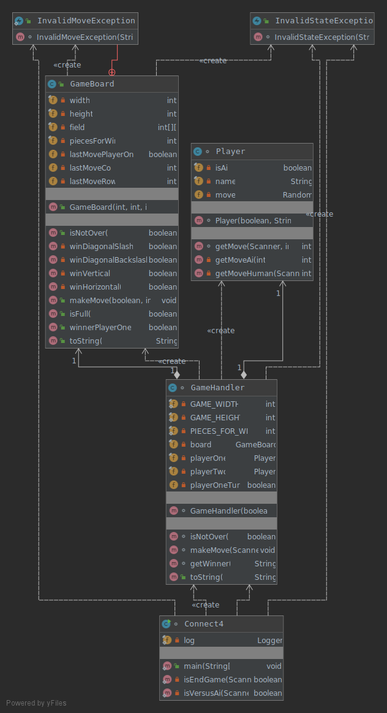

# Connect4
The javadoc can be found [here]()
## 6. Continous Delivery

## 2. Metrics
   

      

## 1. UML Diagrams

## 3. Clean Code Development
## 4. Build
Gradle is used for build management. The configuration is found [here](./gradle.build).
## 5. Unit-Tests
Unit-Tests can be found in the folder [test](./test/org/connect4).
## 7. IDE
Programmed using IntelliJ IDEA. favourite hotkeys:
* ctrl+alt+L Reformat Code
* ctrl+alt+I Auto-Indent Lines
* ctrl+K commit
* ctrl+shift+F Find in Path
## 8. DSL
## 9. Functional Programming
